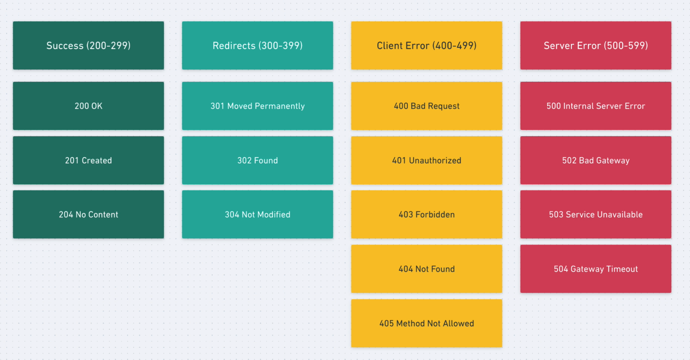

# NestJS Backend App - Events Manager

## Nest Cli

```bash
npm install --global @nestjs/cli
```

## Start New Project

```bash
nest new <project-name>
```

## Installation

```bash
$ npm install
```

## Running the app

```bash
# development
$ npm run start

# watch mode
$ npm run start:dev

# production mode
$ npm run start:prod
```

## Test

```bash
# unit tests
$ npm run test

# e2e tests
$ npm run test:e2e

# test coverage
$ npm run test:cov
```

# Project Structure

**Standard Mode:** One repository contains exactly one Nest project.

**Monorepo Mode:** One repository contains multiple Nest projects/apps (some of them sharing common code)

By default Nest is initialized with standard mode.

The src/ folder contains our application logic.

The test/ folder contains all end-to-end tests.

## Src

Nest is a **modular** framework. As our application grows, we are going to create more modules.

A typical module contains: Controller, Service, Tests, and other parts.

The application starting point is the **main.ts** file, which starts listening to a port.

By default it is also created the **app** module:

- app.module.ts: It contains the @module decorator
- app.controller.ts: There we define API endpoints.
- app.service.ts: Here we add all the business logic, it is not related with handling API requests or sending the response (endpoints), that job is done by the controller.

The test files have a .spec. extension: `app.controller.spec.ts` is the test file for `app.controller.ts`

## Controllers

The controllers are class annotated with the @Controller decorator. Controllers has actions, and action is simply a method that it is associated with an http path for handling requests.

For example:

```
@Get()
getUsers(){

}
```

Is associated with GET /users requests

The job of controllers is to by the entry point for http request using a path and a Rest method (GET, POST, PUT, etc).

**Routing:** is about telling Nest how to convert paths into methods.

Adding the Path prefix:

```
@Controller({path:'/events'})
export class AppController {
  constructor(private readonly appService: AppService) {}

  @Get()
  getHello(): string {
    return this.appService.getHello();
  }
}

// or:

@Controller('/events')
export class AppController {
  constructor(private readonly appService: AppService) {}

  @Get()
  getHello(): string {
    return this.appService.getHello();
  }
}
```

If there is no path prefix, then the controller becomes a top level controller.

We can also define the path for an **action** by using the decorator

```
@Get('/bye')
getBye() {
  return 'Bye !';
}
```

**Resource:** typically resources are database entities: 'Event', 'User', 'Event'.

For every resource we can perform CRUD **actions**: 'Create a User', 'Delete a User'.

For every action we have REST methods: GET, POST, PUT.

A good practice is too **keep your controllers tin**, do not add to many actions to handle (max 5 is a good number).

> Every time we create a new Controller we should add the import inside the app.module.ts controllers array.

```
import { EventsController } from './events.controller';

@Module({
  imports: [],
  controllers: [AppController, EventsController],
  providers: [AppService],
})
export class AppModule {}
```

### Path Parameters

To use path parameteres we need to:

- Route by adding a ':parameter-name' in the decorator string value, e.g: `@Get(':id')`
- To actually use the value passed by the request we need to also add the `@Param('id') id` decorator to the method variable/.

```
@Controller('/events')
export class EventsController {

  @Get(':id')
  findOne(@Param('id') id) {
    return id;
  }
}
```

If you don't add a string value inside the `@Param()` decorator, then you get an object with all the params.

```
@Controller('/events')
export class EventsController {

  @Get(':id')
  findOne(@Param() params) {
    // params is an object -> {id:'value'}
    return params;
  }
}
```

### Request Body

With the `@Body()` decorator we access to the request body

```
  @Post()
  create(@Body() input) {

  }

  @Patch(':id')
  update(@Param('id') id, @Body() input) {

  }
```

### Responses and status code

We simply use the return statement. Nest already takes care to return 201 code for created or 200 for other methods.

Using the `@HttpCode(204)` annotation we can specify a custom response code.

```
  @Get(':id')
  findOne(@Param('id') id) {
    return { id: 1, name: 'Fist Event' };
  }

  @Delete(':id')
  @HttpCode(204)
  remove(@Param('id') id) {

  }
```



### DTO - Data Transfer Objects

A problem with very generic body object, is that we don't know what we are receiving in the request.

We can create a Data Transfer Object, which models the data that we are going to receive.

File: `create-event.dto.ts`

```
export class CreateEventDto {
  name: string;
  description: string;
  when: string;
  address: string;
}

// inside events.controller.ts

 @Post()
  create(@Body() input: CreateEventDto) {
    return input;
  }
```

Using types makes everything more clear an specific, avoid errors.

For Updates (PATCH) actions we will create a different DTO. We don't want to force users to send data that won't change.
We can create a DTO class with all the fields optional, but Typescript and NestJS gives you some powerful tools to write less code. `npm install --save @nestjs/mapped-types`.

```
import { PartialType } from '@nestjs/mapped-types';
import { CreateEventDto } from './create-event.dto';

export class UpdateEventDto extends PartialType(CreateEventDto) {

}

// it has all the fields of CreateEventDto but all are optional.
```
